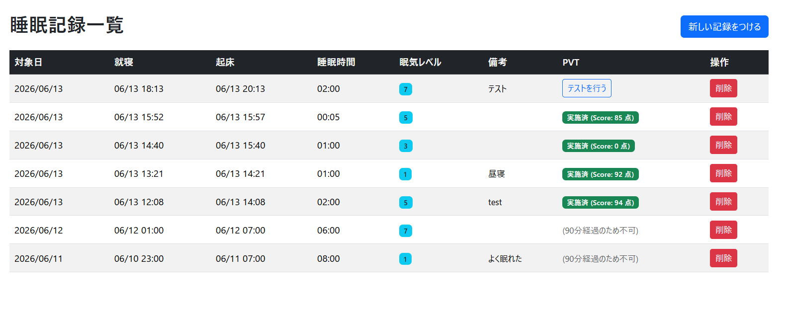
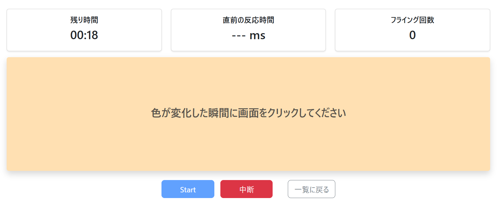

## 目次

1. [プロダクトについて](#プロダクトについて)
2. [採用担当者様に向けて](#採用担当者様に向けて)
3. [今後の展望](#今後の展望)
4. [参考図書](#参考図書)

# 睡眠・パフォーマンス記録アプリ(SleepPvtTracker)

**リポジトリURL：** https://github.com/tKawano0830/SleepPVTApp.git

**デモURL：**

---

## プロダクトについて

### 概要
睡眠記録と起床後の反応速度テスト(Pvt)を実施し、
パフォーマンスを客観的に把握するためのWebアプリケーション

**MVP(ver0.0.1)開発期間**：約3.5日

### 開発の背景
仕事や趣味において、**パフォーマンスを効率よく発揮するには睡眠が最も重要である**と考え、睡眠時間および主観的な眠気と紐づけて客観的なデータを収集するために開発した。
PVT(精神運動覚醒テスト/Psychomotor Vigilance Test)は睡眠研究に用いられている一般的なパフォーマンス評価テストであり、日々の記録として気兼ねなく実施できるよう本来のものより簡素な形式とした。
また、今後他の生活習慣(食事、運動など)とパフォーマンス測定を紐づけるためのベースシステムとしての役割を担う前提もある。

### 実装済みの機能
MVP段階で現在以下の機能を備えている。
- 就寝時間、起床時間、主観的な眠気評価、備考の睡眠記録・削除
- ブラウザによる簡易的なPVTの測定実施
- 睡眠記録へのPVT結果紐づけ、スコア算出や詳細な実施内容の保存

---

## 採用担当者様に向けて

本プロダクトは自身の設計思想や品質担保への姿勢を示すためのポートフォリオとしても開発しましたので、下記に目を通していただけますと幸いです。

### アピールポイント
- 限られた期間内での開発(プロジェクト管理)スキル
- 個人開発における要件定義の基本スキル
- 実務経験のあるC#言語のコーディングスキル
- ドメイン層の自動テスト実装における品質管理スキル
- 「クリーンアーキテクチャ」の考え方に基づいたアーキテクチャ設計思想
- 実務経験が少ない、あるいは全くないWebAPIやUIの基礎知識・最低限の構築スキル(自己学習経験)

### 技術スタック
- **バックエンド**：C# 13, ASP.NET Core 9.0 (MVC)
- **フロントエンド**：JS, Bootstrap, cshtml
- **データベース**：SQLite, Entity Framework Core
- **テスト**：xUnit, Moq
- **インフラ・環境**：Azure App Service, Visual Studio Code

### アーキテクチャ・設計で特に重視した点
- 「睡眠」「PVT」という存在をプロダクトにどう落とし込むか試行錯誤し、**オブジェクト指向言語を最大限活かせるような設計を心がけた。**
(開発中に「睡眠記録」は日単位ではなく一回の睡眠単位で記録し、「昼寝」や「中途覚醒」の実装に対応できる余地を残すという発見などがあった。)
必要な部分は値オブジェクト化し、開発期間とのトレードオフ(過剰な実装を避けること)も意識して実装している。
- Robert C.Martin氏による「Clean Architecture」を参考にし、ビジネスルールをドメイン層に集約させ、DI(依存性の逆転)によって**疎結合で保守しやすい綺麗な設計を心がけた。**
これによってドメイン層はUIやDBに全く依存することがないため、テストや今後の改修しやすさに大きなアドバンテージとなっている。
- ドメイン層におけるDTOを除く全てのエンティティ・サービスクラスの自動テスト(全29パターン)を実装し、**一定レベルの品質担保に努めた。**
正常系・異常系を一通り網羅することを意識し、今後効率的なリファクタリングが出来るようなコーディングを意識した。

### 意図的にスコープ外とした点
アピールポイントに集中し期限内にMVPを完成させるために、以下は意図的に切り捨てました。
- UI/UXを意識した、フレームワークを用いた高度なUI開発
- CoreIdentityを用いたユーザ認証
- CI/CDパイプライン、Dockerなどのインフラ構築
- 実務経験のないJavascript、Bootstrapの0からのコーディング

### 開発における生成AI利用について：
技術力アピールの信憑性を保つため、**AI駆動によるプロジェクトの自動生成(丸投げ)は一切行っておりません。** 以下の用途に限定し、生成されたコードは全て理解・説明できる範疇でのみ利用しています。
- 睡眠研究の論文要約
- 要件によるドメイン、アーキテクチャ設計のための思考の壁打ち
- xUnit・Moqなどのパッケージ、EF(DbContext)といったフレームワーク依存の定型記法の検索
- Bootstrap・Javascript(Pvt実施ロジック)のコード生成

---

## 今後の展望

本プロダクトは自身のパフォーマンス計測ツールとして、今後以下の拡張を行っていく予定である。

### 短期・中期の機能拡張
- エンティティの拡張性を活かした「昼寝」および「中途覚醒」の記録対応
- CoreIdentityによるユーザ認証の機能追加
- より詳細なPVTスコア判定ロジックの実装
- 「食事」「運動」といった他の生活習慣の概念・記録機能追加
- CI/CDパイプラインのインフラ構築
- モダンなフレームワークを用いたUI改善

### 長期的なプロダクトビジョン
- 生成AIを用いたデータ分析、自然言語でのフィードバック機能
- スマートフォンへのネイティブ対応(SPA化/アプリ化)
- ウェアラブルデバイスとの連携機能(ヘルスケアAPIからの睡眠時間の自動取得)

---

## 参考図書
- 『Clean Architecture 達人に学ぶソフトウェアの構造と設計』 Robert C. Martin (著)
- 『独習ASP.NET Core』 山田 祥寛 (著)
- 『ドメイン駆動設計入門 ボトムアップでわかる! ドメイン駆動設計の基本』 成瀬 允宣 (著) 
